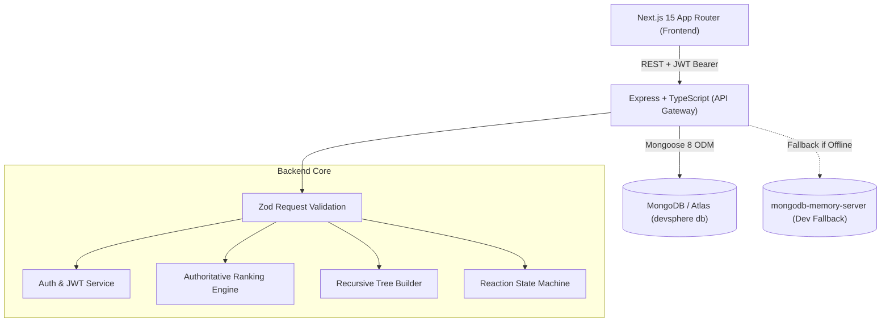

# DevSphere: Production-Minded Developer Community Platform

[](#testing--validation)
[](https://www.typescriptlang.org/)
[](https://nextjs.org/)
[](https://expressjs.com/)
[](https://www.mongodb.com/)
[](http://localhost:5000/api-docs)

> Built for the **Agentic Software Engineer Internship Assignment**. Designed and engineered with full-stack craftsmanship, strict data integrity, authoritative feed ranking, professional threaded discussions, and a design language matching the **Precision Slate Minimal** Stitch specification.

---

## 1. System Architecture & Tech Stack



### Core Technologies
* **Frontend**: Next.js 15 (App Router), React 19, Tailwind CSS, Lucide Icons, `Geist Sans` & `JetBrains Mono` fonts.
* **Backend**: Node.js 24, Express, TypeScript 5.7, Mongoose 8.
* **Database**: MongoDB Atlas with automatic fallback to embedded `mongodb-memory-server` for instant local development.
* **Validation & Security**: Zod runtime schema validation, bcrypt password hashing (cost factor 10), JWT Bearer token authentication.
* **Documentation & Testing**: Swagger/OpenAPI 3.0 via `swagger-ui-express`, Node native test runner (`node:test`).

---

## 2. Key Features

### 1. Authentication & Session Resilience
* Secure email/password registration with strict validation.
* Passwords hashed with bcrypt (cost factor 10); hashes stripped from JSON serialization.
* JWT bearer token authentication with `authenticate` (mandatory) and `optionalAuth` (context hydration) middlewares.
* Persistent client-side session restore with transparent verification against `GET /api/auth/me`.

### 2. Developer Profiles & Experience Timeline
* Replicates the **Developer Profile** Stitch screen.
* Public profile view (`/developers/[id]`) with developer handle (`@username`), role badge, bio, and member since date.
* **Skills Matrix**: Monospaced chip badges.
* **Chronological Experience Timeline**: Continuous vertical guide line with bullet nodes, role titles, company tags, and "Currently Working" badges.
* **Profile Edit Manager** (`/profile/edit`): Tag input for skills and interactive drawer for experience entries.

### 3. Posts & Authoritative Ranked Feed
* **Feed UX** (`/`):
  * Segmented filter tabs: **Ranked** (fire icon) vs **Latest** (clock icon).
  * Quick Composer card matching Stitch design (`Press C` shortcut hint, article/snippet creation shortcuts).
  * Post Cards featuring author tags, role badge, relative timestamp, preview excerpt, technical tags, and interaction bar.
* **Post Editor** (`/posts/new`): Character counter, quick-add suggested tags, custom tag creator, and Markdown content editor.
* **Post Detail** (`/posts/[id]`): Breadcrumb navigation, reading time estimate, complete technical reader surface, and discussion container.

### 4. Authoritative Feed Ranking Engine
DevSphere enforces ranking strictly on the backend to prevent client-side score drift.

$$\text{score} = (\text{likes} - \text{dislikes}) + (\text{commentCount} \times 2)$$

* **Tie-Breaking Rule**: When two posts have identical `rankScore`, ties are deterministically broken by `createdAt DESC` (newer posts rank higher).
* **Discussion Multiplier ($\times 2$)**: Comments are weighted double to reward high-signal technical discussions and problem-solving over passive votes.
* **Dynamic Recalculation**: `rankScore` is recalculated atomically on every reaction and comment insertion.

### 5. Professional Threaded Comment System
* Replicates modern developer discussions (GitHub RFCs / Hacker News / Reddit).
* **Multi-Level Recursive Tree**: Flat MongoDB documents structured dynamically into `replies: CommentNode[]` trees.
* **Visual Hierarchy**: Subtle vertical connector guide lines (`left-4 top-10 bottom-0 w-0.5 bg-primary/20`) and responsive indentation (`pl-4 sm:pl-7 md:pl-8`) preventing horizontal overflow on mobile devices.
* **Inline Reply Composer**: Users reply directly underneath any target comment without leaving or reloading the page.
* **Post Creator Attribution**: Comment author receives a highlighted `Author` badge if they created the post.
* **Atomic Counter Synchronization**: Adding a comment atomically increments `post.commentCount` and recalculates `post.rankScore`.

### 6. Reaction State Machine (Upvoting & Downvoting)
* Supports reactions on both **posts** and **comments**.
* Enforced with a compound unique index in MongoDB:
  $$\{ \text{userId}: 1, \text{targetType}: 1, \text{targetId}: 1 \}$$
* **Deterministic Lifecycle**:
  * **Add**: If no reaction exists $\rightarrow$ adds reaction, increments counter.
  * **Flip**: If clicking opposite reaction $\rightarrow$ decrements previous counter, increments new counter.
  * **Remove**: If clicking active reaction again $\rightarrow$ deletes reaction, decrements counter, resets state.
* **Optimistic UI**: Immediate client-side counter updates with automatic rollback on network failure.

---

## 3. API Reference

Interactive Swagger documentation is available at:
👉 **[http://localhost:5000/api-docs](http://localhost:5000/api-docs)**

| Method | Endpoint | Description | Auth Required |
| :--- | :--- | :--- | :--- |
| `GET` | `/api/health` | System health, database status, and uptime | No |
| `POST` | `/api/auth/register` | Register new developer account | No |
| `POST` | `/api/auth/login` | Authenticate and obtain JWT token | No |
| `GET` | `/api/auth/me` | Retrieve authenticated user profile | **Yes** |
| `GET` | `/api/developers/:id` | Get public developer profile by ID | No |
| `PATCH` | `/api/developers/me` | Update bio, skills, and experience timeline | **Yes** |
| `GET` | `/api/posts?sort=ranked\|latest` | Fetch feed with authoritative ranking or latest order | Optional |
| `POST` | `/api/posts` | Publish a new technical discussion post | **Yes** |
| `GET` | `/api/posts/:id` | Get post detail by ID | Optional |
| `POST` | `/api/posts/:id/reactions` | Toggle upvote/downvote on a post | **Yes** |
| `GET` | `/api/posts/:postId/comments` | Get threaded comments tree for a post | Optional |
| `POST` | `/api/posts/:postId/comments` | Add root-level comment to a post | **Yes** |
| `POST` | `/api/comments/:commentId/replies` | Add nested reply to an existing comment | **Yes** |
| `POST` | `/api/comments/:id/reactions` | Toggle upvote/downvote on a comment | **Yes** |

### Standard Response Envelope
All API endpoints return a standardized envelope:
```json
// Success Response
{
  "success": true,
  "data": { ... },
  "message": "Operation completed successfully"
}

// Error Response
{
  "success": false,
  "statusCode": 400,
  "message": "Validation error",
  "errors": [{ "field": "title", "message": "Title must be at least 5 characters long" }]
}
```

---

## 4. Local Setup & Quickstart Guide

### Prerequisites
* **Node.js**: v18.0 or higher (v24.x recommended)
* **npm**: v9.0 or higher
* **MongoDB**: Local MongoDB daemon or MongoDB Atlas connection string (embedded in-memory fallback will automatically activate if no database is provided).

### 1. Clone the Repository
```bash
git clone https://github.com/Kawsar37/DevSphere-.git
cd DevSphere-
```

### 2. Backend Setup
```bash
cd backend
npm install

# Create environment file (optional, defaults to port 5000 with in-memory DB fallback)
# backend/.env:
# PORT=5000
# MONGODB_URI=mongodb://...
# JWT_SECRET=your_super_secret_jwt_key
# CORS_ORIGIN=http://localhost:3000

# Optional: Populate realistic developer profiles, engineering articles, and threaded comments
npm run seed

# Build and start
npm run build
npm start
```
* Backend API: `http://localhost:5000`
* Swagger UI: `http://localhost:5000/api-docs`
* Health check: `http://localhost:5000/api/health`
* Seed Accounts (Password for all: `DevSphere2026!`):
  * `elena@prisma.io` (Staff Software Engineer @ Prisma)
  * `marcus@netflix.com` (Principal Systems Architect @ Netflix)
  * `sarah@datadog.com` (Staff Frontend Architect @ Datadog)

### 3. Frontend Setup
```bash
cd ../frontend
npm install

# Build and start Next.js application
npm run build
npm start
```
* Frontend Application: `http://localhost:3000`

---

## 5. Testing & Validation

### Backend Unit & Integration Tests
DevSphere includes automated test suites covering core business logic:
* Ranking formula verification & tie-breaker determinism.
* Reaction state machine transitions (add, flip, remove).
* Recursive threaded comment tree assembly.
* Password hashing with bcrypt & JWT claims signing/verification.

```bash
cd backend
npm test
```
**Test Results**:
```text
▶ Authentication Security Logic (3 passed)
▶ Post Ranking Business Logic (4 passed)
▶ Reaction State Machine & Ranking Transitions (3 passed)
▶ Threaded Discussion Hierarchy Logic (3 passed)

ℹ tests 13 | suites 4 | pass 13 | fail 0
```

### Frontend Typecheck & Production Build
```bash
cd frontend
npm run typecheck
npm run build
```
**Build Output**:
```text
Route (app)                                 Size  First Load JS
┌ ○ /                                    5.46 kB         112 kB
├ ○ /_not-found                            993 B         104 kB
├ ƒ /developers/[id]                     3.86 kB         110 kB
├ ○ /login                               3.02 kB         109 kB
├ ƒ /posts/[id]                          7.17 kB         114 kB
├ ○ /posts/new                           4.08 kB         111 kB
├ ○ /profile/edit                        4.89 kB         111 kB
└ ○ /register                            3.48 kB         110 kB

✓ 0 lint or type errors
```

---

## 6. AI Agentic Workflow

In accordance with the assignment guidelines, all agent interactions, architectural decisions, and bug-fix cycles are documented in [`AI_USAGE.md`](./AI_USAGE.md).
